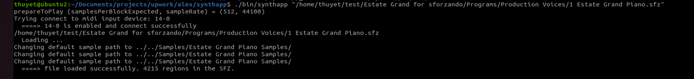

## Clone source code
git clone https://github.com/pvthuyet/synthapp.git  
git submodule update --init --recursive  

## Install dependancies for Linux
* https://github.com/juce-framework/JUCE/blob/master/docs/Linux%20Dependencies.md  
```
sudo apt update
sudo apt install libasound2-dev libjack-jackd2-dev \
    ladspa-sdk \
    libcurl4-openssl-dev  \
    libfreetype6-dev \
    libx11-dev libxcomposite-dev libxcursor-dev libxcursor-dev libxext-dev libxinerama-dev libxrandr-dev libxrender-dev \
    libwebkit2gtk-4.0-dev \
    libglu1-mesa-dev mesa-common-dev
```  
## How to build
#### Console app
```
./buid.sh clean
```
#### GUI app
```
cmake -B build -S . -DSHOW_GUI=1
cmake --build build --target synthapp --config Release
```

## How to run
```
./synthapp "./soundfonts/Clarinet.sf2"
./synthapp "./soundfonts/952588_KitLyreV2_MarkReuter/Kit_Lyre/instruments/firelyre.sfz"
```
  

